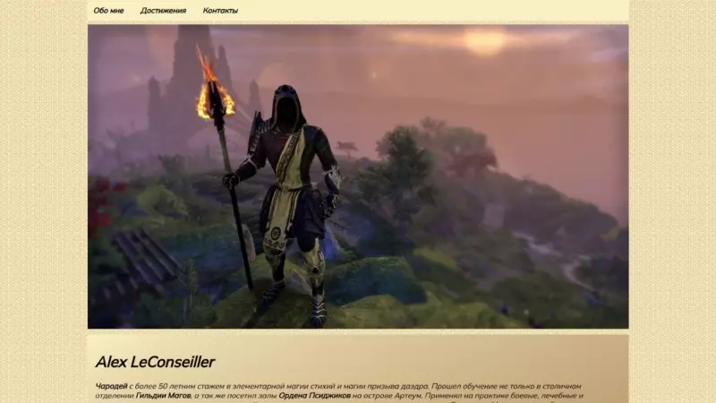
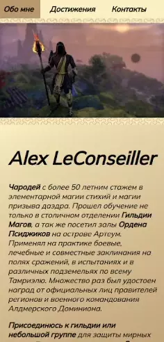
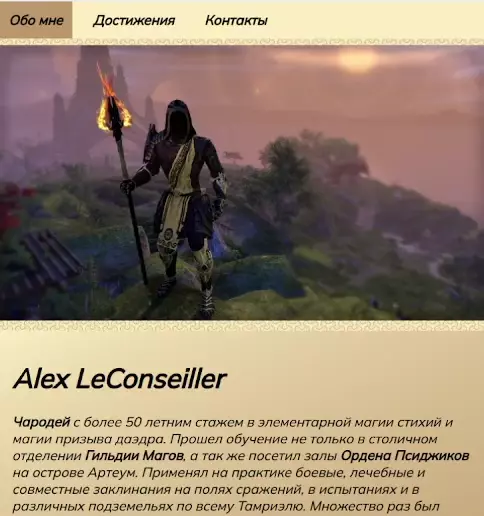

# Alex LeConseiller - simple landing

### Use Skills

---

[Demo Link   ](https://golovanovalex.github.io/AlexLeConseiller/)

## Info

Создано на основе задания от [Result School](https://result.school/products).

Верстка с нуля простого сайта-лендинга. Работа с **HTML**, **CSS**.  
Обучение основам работой с тегами, со ссылками, фоном блоков и другими элементами сайта. А так же адаптивности и гибкому дизайну.
Пройдена валидация HTML и CSS.

---

Респонсивный дизайн адаптирует сайт под любой экран устройства.

 &nbsp;&nbsp;&nbsp;&nbsp;&nbsp;&nbsp;&nbsp;

---

## Contacts

- <a href="mailto:golovanov.a.a@yandex.ru" >Golovanov.a.a@yandex.ru</a>

 Made with 💙
